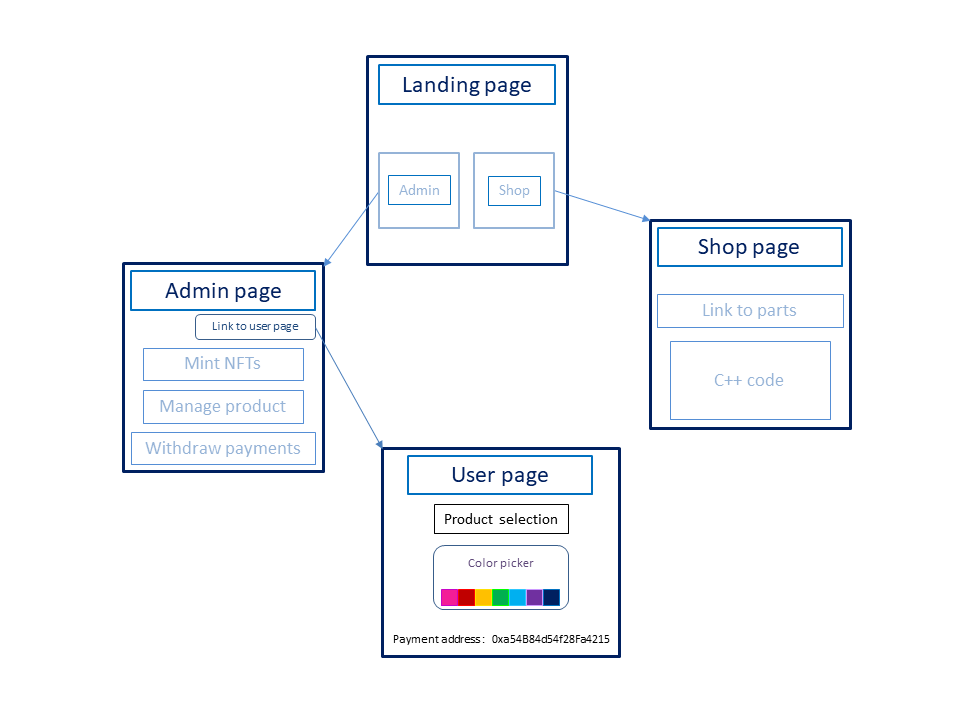
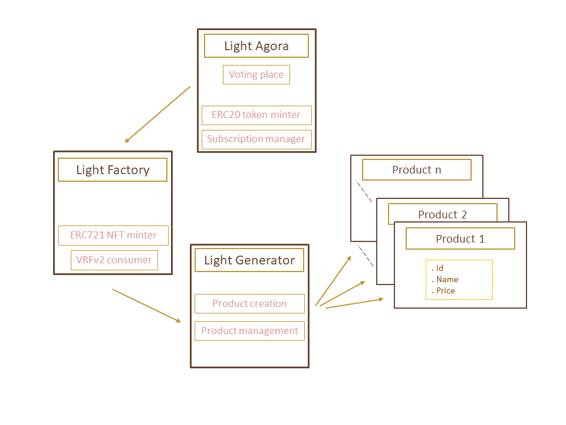

# Candy Lamps: An Adaptable Blockchain IoT Interface

Candy Lamps is a solution that provides users with a real world, IoT to blockchain interaction, in a simple, easy to use, and fun experience. Pick a color, and send payment. It’s that easy to use!

## Introduction and context

Our hackathon team wanted to create an interactive, real world use case for blockchain, smart contracts and NFTs. Price feeds and DeFi protocols are cool, but we wanted to create a fun, unique product that users can understand and experience in the real world.
Our bare concept is to offer a possibility for vendors to acquire a selling platform with customizable products and sell them easily to customers via the scan of a QR code (payable in ether). We wanted to showcase our platform concept with a fun proof of concept.

This is where Candy Lamps comes in. Candy Lamps is software powered by blockchain smart contracts that allows people to pay to change the colors of a lighting system. Candy Lamps can be set up locally in a bar and connected to the lighting systems, or set up to be accessed from anyone, anywhere in the world. The approach we took was similar to that of an old school diner jukebox. The diner owns the jukebox, and customers can pay a quarter(or a custom amount) to play the song of their choice. Similar to a diner jukebox, owners of a lighting system can allow customers to pay to change the color of the lights.

Setup process for owners: Owners get their own special Admin page for setup, management, and accounting. This page is hidden from non-Admin users. Owners pay to mint an NFT. This NFT is used as a key, similar to a license. Owners can add products (lightstrip 1, lightstrip 2, lightbulb 1, lightbulb 2, patio lights 1, static light change, dynamic light pattern 1, etc) to be associated with that NFT. Each product has an address and when payment is sent to the product address, it triggers that specific lighting product to change color. Funds that have been collected from payment addresses can be withdrawn to the owner’s desired wallet.

Interaction process for users: There are just 2 steps required of users to interact with the lights. Users need to select a color, and then send payment to the address. Simple and easy to use.

You can see a high level walkthrough of this application in this [video](https://www.youtube.com/watch?v=lql5T5WAWBU):

## Running the dApp locally
After downloading the files of this repository, open the prompt on the project root directory and type the following command:

```npm run build```

Be sure to have all required python libraries installed. Run the command:

```pip install -r requirements.txt```

You also have to provide a secret key to the socketio application. Put the secret key at line 8 on the app.py file or create a .env file with a variable named SECRET_KEY with a secret assigned to it.

Now it is all set to run the dApp! Type the following command:

```python app.py``` / ```python3 app.py```

Then, open the browser and go to:

```http://localhost:5000/```

## Running the dApp remotely
To deploy on Heroku, an user account need to be created. Go to the [Heroku](https://www.heroku.com/) webpage and create an user. After that, create an app project on Heroku.

Download and install the Heroku CLI by typing on the prompt (more info [here](https://devcenter.heroku.com/articles/heroku-cli)):

```npm install -g heroku```

Download the files of this repository, go to the project root folder and type the following command on the prompt in order to login to Heroku:

```heroku login```

Then, connect your Heroku project with your local project:

```heroku git:clone -a project-name```

You also have to provide a secret key to the socketio application. Put the secret key at line 8 on the app.py file or create a .env file with a variable named SECRET_KEY with a secret assigned to it.

Finally, add the local files, commit and deploy to Heroku:

```
git add .
git commit -m "deploying"
git push heroku master
```

Open the app on Heroku and have fun!

A working dApp is running on: https://candy-lamps.herokuapp.com/

## App design

The app consists of 4 panels (see diagram):

| App diagram  |
|  |

- The landing page that guides the user to choose between two options:

- The shop panel, where one can find links to buy the necessary hardware to set up a light system and the c++ code to run the light change at the hardware level.

- The admin panel where one(business owner or anyone) can buy an NFT linked to a light generator.
 This panel lists all the NFTs owned by the connected wallet and allows the NFT owner to create products, change the price of a product or withdraw the accumulated funds from one or a selection of products. On the top right of this panel there is a custom link related to the account connected that leads to the 4th panel.

- The 4th panel is designed for the user interaction with the products. At the top, the user can select an NFT in a drop down menu and then select a product attached to that NFT. Then pick a color and send the right amount of ETH to the address at the bottom of the page - copying the address is tedious, we made it easy with a QR code that pops up and can be scanned with a phone.

## Contracts architecture

The backend Web3 architecture consists of 4 contracts, an Agora(council place) contract, a factory contract, a generator contract and a product contract (see diagram):

| Contracts diagram  |
|  |

- The first contract is an Agora, or council place for us, the app builders, to deploy the factory contract or vote on changes such as changing the price of the NFTs the Factory mints via a rudimentary(for now) voting system. It is also ERC20 and mints tokens for a future ecosystem and a VRFv2 subscription manager. This contracts splits evenly all incoming eth payments between the developers.

- The Factory contract is deployed in the constructor of the Agora contract. This contract is ERC7721. It contains a function mintGenerator that both deploys a Generator contract and attaches a freshly minted NFT to it. This NFT conceptually ressembles a key to the generator.

- The Generator contracts functions are mostly restricted to the NFT owner. This contract gives the possibility to its owner to deploy product contracts with a name and price tag. From this generator, its owner can withdraw in bulk the funds from all the products.

- The product contracts are payable, the choice to have one contract per product was made for versatility and ease for the user to simply send payment to the contract via a QR code, bypassing the requirement to connect their wallet to the page in the case of a function call (both options are available for later app versions).


## Languages, Libraries, Frameworks, and Tools
<div style="background-color: gray;">
  
  
  
    
  
  
  
  
  
  
  
  
  
</div>


- [brownie](https://pypi.org/project/eth-brownie/)
- [chainlink-price-feeds](https://docs.chain.link/docs/using-chainlink-reference-contracts/)
- [chainlink-vrfv2](https://docs.chain.link/docs/chainlink-vrf/)
- [ethers.js](https://docs.ethers.io/v5/)
- [ipfs](https://ipfs.io/)
- [metamask](https://metamask.io/)
- [pinata](https://www.pinata.cloud/)


## Add CodeOwners
